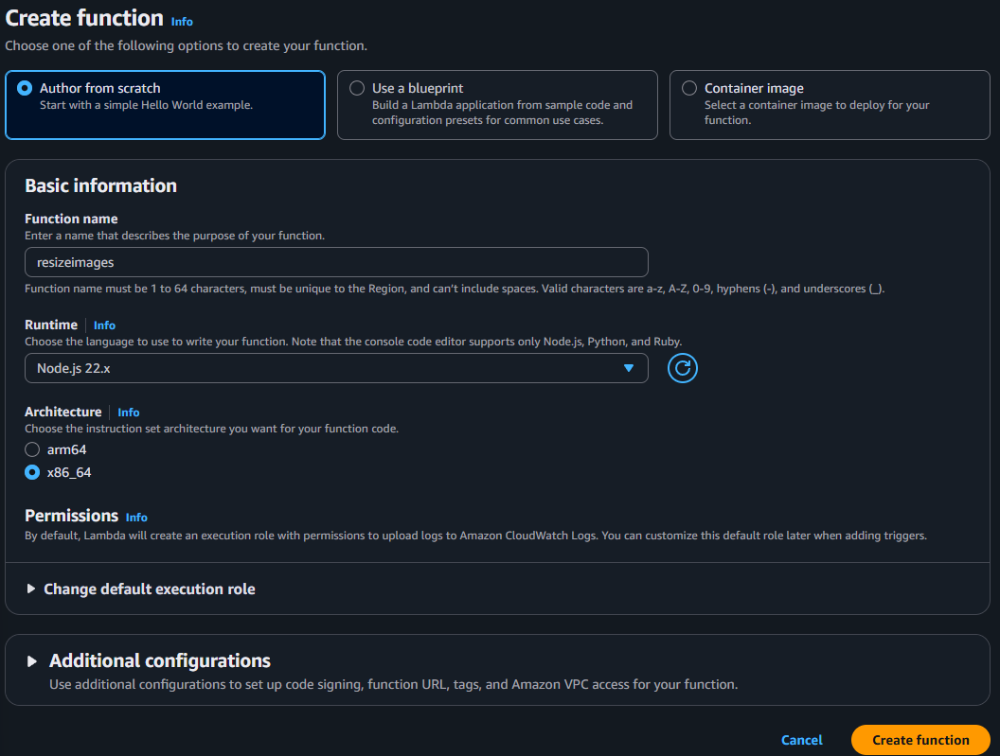
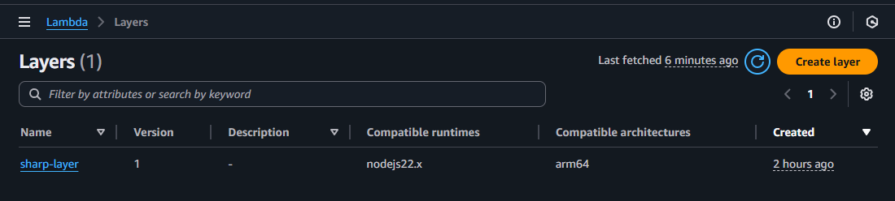
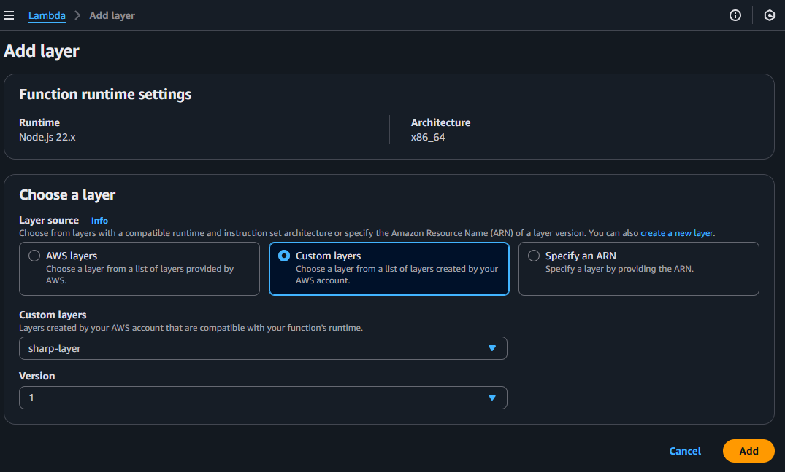
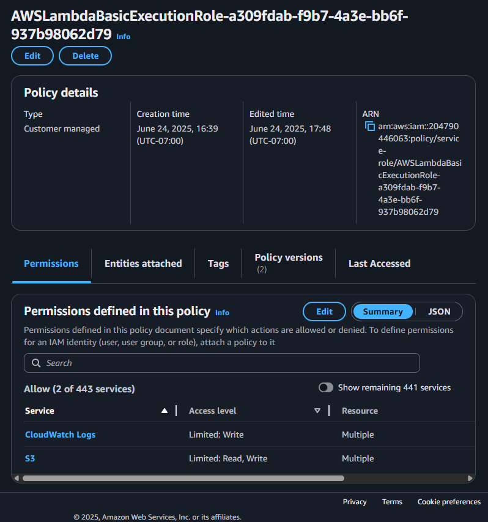
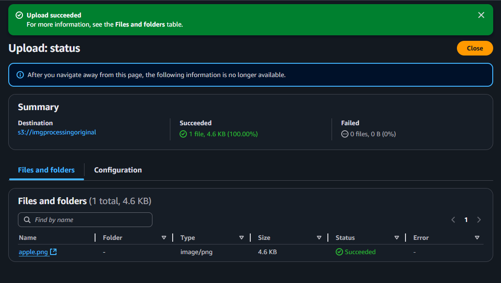

# Serverless Image Processing App
In this assigment I developed a 'Serverless Image Processing App' using AWS Lambda and Amazon S3.

This app process images that are instered into one bucket and resize them to a 512x512px size and then appends the image to another bucket where all processed images reside.

This works by using AWS Lambda for triggering on upload of a file in the first AWS S3 bucket and then using a secondary AWS S3 bucket to store the modified image.

# Project Setup
To start this project you will need a AWS Account, if you create yours whithin the past 12 months, this app should come at no price becuase we will be well under the 12 month free-tier usage.

To start the development of this project we are going to need two buckets `imgprocessingoriginal` and `imgprocessingresized1`.
To do this we need to go to `Amazon S3` inside our AWS Dashboard.
Once there we select `Create Bucket`.

 
## Setup the S3 Buckets
Once inside the Create Bucket page we do not need to change much, just select a name and set the type to `General Purpose`.

*Note: All users share the same S3 naming space, so you'll have to check disponibility of the name of your S3 buckets.*

#### Create the first bucket
Select a name and set it to 'General Purpose', leave everyithing else default.


#### Create the second bucket
We do the same for our second bucket, but this time with another name.


#### Verify the bucket creation in the Dashboard
Once both S3 are created we will be able to see them in the S3 Dashboard.


Now they are ready for storing our images.

## Setup of Lambda Function
Now we need a Lambda function for the serverless functionallity, this Lambda Function will:
1. Respond to events in the first 'imgprocesingoriginal' bucket when a new image is added.
2. Then it is going to process it to resize it.
3. At last it will store it in the 'imgprocessingresized1' bucket.

To do this, we need to setup the Lambda, for this we go to `Lambda` in our AWS Dashboard.

### Create the Lambda Function
We click on `Create Function` and we select a name for our function and the runtime.

In this project we will be using Node to be able to use Sharp for resizing the images.

#### Setup the Lambda Function



### Code the Resize Lambda Function
---
Now lets setup the code for our Lambda Function, for this part we will need to set it up locally due to two reasons:

1. Sharp has packages depending on the enviroment
2. AWS Node does not includes AWS-SDK by default after Node 18+ (The current version is 22.X)

To get around this issues we will be creating the files locally in our machine and then uploading them as a .zip to the Lambda Function that we created.

And as for Sharp, there is a public Git Hub repository that holds the Sharp packages as Lambda Layer Ready, but we will be needing to setup a Layer and attach it to our Lambda.

For this we will do as follow:

*Note: You will need Node installed in your system*

### Setup the Project
---
First we need a Node Project, so we do as follow:
1. Create a folder anywhere, this folder is going to be where the code will be.
2. Open the terminal and type `npm init -y` to start a Node project.
3. Install AWS-SDK by typing `npm install aws-sdk`*
4. Create an `index.mjs` file and open it using VSCode or any editor.
 
**Note: The aws-sdk that we will be installing is the AWS SDK v2 and there are some changes compared to v3 as to how to import and call some functions*

#### Writing the Code
Once inside `index.mjs` we will be coding the functionallity of resizing and storing the images, so for this we will be using the code below:

Be mindful that `DEST_BUCKET` is YOUR bucket exact name where the processed images will go.

Here you can play with the `.resize()` function to change the output size of the image, this code set it to 512 x 512 px.

Last, note how there are `Console.logs` on finish or if some exception is raised, this allow you to debug the code by attaching a Cloud Watch to be able to store and see each invocation logs.

#### index.mjs
```JavaScript
import { createRequire } from 'module';
const require = createRequire(import.meta.url);

const AWS = require('aws-sdk');
const Sharp = require('sharp');

const S3 = new AWS.S3();

const DEST_BUCKET = 'imgprocessingresized1'; //Should Match the exact name of destination

export const handler = async (event) => {
  const record = event.Records[0];
  const srcBucket = record.s3.bucket.name;
  const srcKey = decodeURIComponent(record.s3.object.key.replace(/\+/g, ' '));

  const path = require('path');

  const dstKey = path.basename(srcKey);

  try {
    const originalImage = await S3.getObject({ Bucket: srcBucket, Key: srcKey }).promise();

    // Resizes the images to 512x512
    const resizedImage = await Sharp(originalImage.Body)
      .resize(512,512)
      .toBuffer();
      
    await S3.putObject({
      Bucket: DEST_BUCKET,
      Key: dstKey,
      Body: resizedImage,
      ContentType: 'image/png',
    }).promise();

    console.log(`Image ${srcKey} sucessfully processed and stored in: ${DEST_BUCKET}/${dstKey}`);
  } catch (err) {
    console.error('Error processing image:', err);
    throw err;
  }
};
```
#### Uploading the Code to Lambda
---
Now, to finish this step, we need to zip this project in a `.zip` file, but be mindful that you will need to **zip all the files inside your folder**, not the project folder itself


Now the project is ready to be put in Lambda, to do this we will be clicking `Upload From` inside our Lambda Function Dashboard.


Note that the naming of the .zip file does not matter but make sure that the project files are inside the .zip and NOT the project folder.

Now the `Code Source` should be looking something like this:


### Setup Layers for Sharp
---
As I mentioned previously, the contents of the Sharp Library are dependant on the platform where they are being used, because AWS uses Linux and I developed this in Windows, if I just use npm to install Sharp and upload it with the .zip file, the app will crash.

So to avoid this we will be using a Sharp Layer Ready library that we can find in the following [Repo](https://github.com/pH200/sharp-layer)

To setup we need to follow these steps:

#### Setup a Layer in AWS
Go to the `Lambda` dashboard in AWS and then search for `Layers`

Then click on `Create Layer`, you will see this page:


Here you will be setting up a Name for the layer and optionally a Description.

Then you need to select `upload .zip file` and select the .zip file that is available at the pH2000 repo [releases section](https://github.com/pH200/sharp-layer/releases) (Download release-x64) for the current version.

Then set the runtime and compatible architecture as x86_64 and Node.js.

Once done click on `Create`


Your new layer should be visible under `Lambda > Layers`.

Now its ready to be attached to our lambda function.



#### Attach the Layer to Lambda
Now with our Layer created we need to attach it to our Lambda so it is able to use it, go to the Resize Image Lambda Function and scroll down till you see `Layers` and click on `Add Layer`

Here you will be selecting `Custom Layers`

Then select the layer you just created in the drop down menu and select the version, there should be only one version available.

Once done, click on `Add`


Now your layers section should be looking like this


Now the Lambda Code Setup is done, now we need to add the trigger that will execute our code, for this check the next section.

### Setup the Trigger
---
Now that the logic of the lambda is there, we ned to setup the trigger that our lambda function will wait for to execute, for this we go into `Add Triggers` and we set `S3`


Then we set the bucket that will cause the trigger, in this case `imgprocessingoriginal`

Then under events we need to make shure the `All Object Create Events` is selected


After that, our lambda should be looking like this:


## Manage Lambda Permissions
Now that our Lambda is setup we need to finish the last detail, **permissions**, for this we need to go in to the permissions section that its inside the Configuration tab in our Lambda Function and click the `View Policy` or `Role Name` attached to it.


Alternatively you can make it to the same menu going to `IAM > Roles > #LambdaName-role-NXNXNX` this role should be a random string automatically generated if you didnt attached any role policy on creation.

Here you'll click the permission policy to get into its details


Once you click it you'll have this page, here you will select `edit`


Now we will be able to see the permissions either Visually or on a JSON type.
Here we need to add the permissions for:
* `Read` the Original Images S3 Bucket.
* `Write` to the Resized Image S3 Bucket.
* `CloudWatch` for logging (Optional but recomended)


In this policy, Cloud Watch was set up automatically so we only need to add the S3 Permissions and they should look something like this:
```JSON
{
	"Version": "2012-10-17",
	"Statement": [
		{
            "Effect": "Allow",
            "Action": [
                "s3:GetObject",
                "s3:PutObject"
            ],
            "Resource": [
                "arn:aws:s3:::your-source-bucket/*",
                "arn:aws:s3:::your-destination-bucket/*"
            ]
        }
	]
}
```
*Note: You will need to place the name of each bucket after the `::::` and leave the `/*` because this refers to the bucket items, meaning it gives permission to read or put ITEMS inside the bucket*


*Note2: You can add items visually or use the interface at the right to add a statement with the correct syntax withouth the need of writting the JSON yourself.*

Once added, click next and review the new permissions, if everyithing checks up, click save and the policy should reflect the S3 permissions of `Limited: Read, Write`



## The Image Processing Working
Now that we have everything setup we should be able to just upload an image into the `imgprocessingoriginal` and the image should be appear processed in the `imgprocessingprocessed1` bucket automatically due to the Lambda execution.

For this example we will be using an apple image in a .png extension that is 225x225px, meaning our app will be increasing its size


So to check if everything work, go to `S3` and click the `imgprocessingoriginal` and here click `upload` to upload an image either by selecting it from our files or drag and dropping it.



Now go to `imgprocessingprocessed1` bucket and lets check if our lambda worked.


If everything went according to plan, a new image with the same name should be inside the processed bucket, and if we pay close attentiont we se that the file size has increased from 4.6KB to 19.8KB, meaning some processing had happened.

If we want to make sure, lets download the image


As you can see, the size has increased to 512x512, meaning our Lambda Image Processor is working.

## Cloud Watch Logs
Other way to make sure our app works is by looking at the logs of cloud watch, if setted properly here everything should be logged.

If you go to `CloudWatch > Log Groups > #LambdaName` there should be an entry for each lambda invocation that holds all the logs.

Here we can see that in fact our lambda executed correctly.


# Summary
By using AWS Lambda you can create a serverless app with different functionallity based on your requirements.

As you can see Lambda is a powerful tool and it also allows for custom enviroment setup so we are not restricted by its enviroment and because of its strong integration with all the other AWS components it is easy to set up complex work flows that go across multiple services with ease.

## Credits
Developed by: Luis Marin

## Notes
*AWS Free Tier*

Be mindful of the AWS costs, AWS Lambda is always free up to 1 million requests a month but S3 storage is NOT free and it charges per GB and ammount of get/put requests a month.

If you have a new account you will have a 12-month period of free S3 storage up to 5GB and certain ammount of put/get requests, for more information check the Official AWS Documentation about the [AWS Free Tier](https://aws.amazon.com/free/?all-free-tier.sort-by=item.additionalFields.SortRank&all-free-tier.sort-order=asc&awsf.Free%20Tier%20Types=*all&awsf.Free%20Tier%20Categories=*all)

---
*Sharp*

The Sharp Layer used here comes from a repository hold by pH200, if you are trying to recreate this in the future a new version might be available, you can check the repo in this [Link](https://github.com/pH200/sharp-layer)